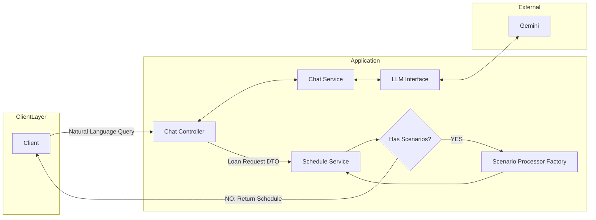

# Loan GPT

## Overview

A chat like interface which responds to loan queries in natural language and simulate prepayment scenarios.

## Problem Statement
User wants to
- Calculate monthly EMI
- Simulate prepayment scenarios
- Compare loan scenarios
- Evaluate Tenure Reduction
- Check affordability of loans

## Functional Requirements
- Intent detection from natural language query
- Financial calculations like EMI, Prepayments
- Generate amortization schedule
- Compare prepayment scenarios
  - One time lumpsum additional payment
  - Recurring additional payment
  - Step up EMI
- Constraint/Edge case checking on financial inputs, prepayments etc.

## Non Functional Requirements
- Performance : All calculations should complete within 50ms.
- Reliability : Loan calculations must maintain mathematical precision and should be deterministically testable.
- Maintainability : Code should follow proper design principals so that individual components can be added / modified / removed confidently.

## Design principals
- Extensibility
- Maintainablity
- Adhering to good design principals
  - REST design principals
  - Loose coupling
  - Separation of concerns using MVC
- Logging
- Deterministic calculations
- Financial Precision

## Rest API Design

### Resource Modeling

Core resources:
- loan - A loan with principal, interest and tenure. User can also ask for different scenarios as mentioned above.

## Architecture


## API Endpoints

### 1. Generate Amortization Schedule

#### Endpoint
```
POST /loan
```
#### Request
```json
{
  "loanParameters": {
    "principal": 5000000,
    "interestRate": 8,
    "tenureInMonths": 240
}
}
```

#### Response
```json
{
    "installmentAmount": 43391.16,
    "totalInterestPayable": 5413879.44,
    "totalPayment": 10413878.40,
    "schedule": [
        {
            "extraPayment": 0,
            "installmentAmount": 43391.16,
            "installmentNumber": 1,
            "interest": 35416.67,
            "outstandingPrincipal": 4992025.51,
            "principal": 7974.49
        },
        {
          // Rest of schedule entries...
        },
        {
            "extraPayment": 0,
            "installmentAmount": 43391.16,
            "installmentNumber": 240,
            "interest": 305.20,
            "outstandingPrincipal": 0,
            "principal": 43085.96
        },
    ]
}
```

### 2. Simulate Scenarios

##### Endpoint
```
POST /loan
```
##### Request
```json
{
  "principal": 5000000,
  "interestRate": 8.5,
  "tenureInMonths": 240,

  "scenarioType": [
    {
      "scenarioType": "RECURRING_PREPAYMENT",
      "startMonth": 48,
      "amount": 25000,
      "frequencyType": "ANNUALLY"
    }
  ]
}
```

#### Response
```json
{
    "installmentAmount": 43391.16,
    "totalInterestPayable": 4982552.44,
    "totalPayment": 9982552.44,
    "schedule": [
        {
            "extraPayment": 0,
            "installmentAmount": 43391.16,
            "installmentNumber": 1,
            "interest": 35416.67,
            "outstandingPrincipal": 4992025.51,
            "principal": 7974.49
        },
        {
          // Rest of schedule entries...
        },
        {
            "extraPayment": 25000,  
            "installmentAmount": 43391.16,
            "installmentNumber": 48,
            "interest": 32279.54,
            "outstandingPrincipal": 4521000.18,
            "principal": 11111.62
        },
        {
          // Rest of schedule entries...
        },
        {
            "extraPayment": 0,
            "installmentAmount": 18106.08,
            "installmentNumber": 222,
            "interest": 127.35,
            "outstandingPrincipal": 0,
            "principal": 17978.73
        }
    ]
}
```


### 3. Generate ammoritzation schedule and simulate scenarios using natural language
##### Endpoint
```
POST /chat
```
##### Request
``` Natural language
I have a loan of 3Cr for 20 years at 8% interest.
I want to pay 1 lakh extra every year.
```

#### Response
```json
{
    "installmentAmount": 250932.02,
    "totalInterestPayable": 27429257.50,
    "totalPayment": 57429257.50,
    "schedule": [
        {
            "extraPayment": 100000,
            "installmentAmount": 250932.02,
            "installmentNumber": 1,
            "interest": 200000.00,
            "outstandingPrincipal": 29849067.98,
            "principal": 50932.02
        },
        {
            "extraPayment": 0,
            "installmentAmount": 250932.02,
            "installmentNumber": 2,
            "interest": 198993.79,
            "outstandingPrincipal": 29797129.75,
            "principal": 51938.23
        },
        {
          // Rest of schedule entries...
        },
        {
            "extraPayment": 0,
            "installmentAmount": 73281.08,
            "installmentNumber": 222,
            "interest": 485.31,
            "outstandingPrincipal": 0,
            "principal": 72795.77
        }
    ]
}
```
